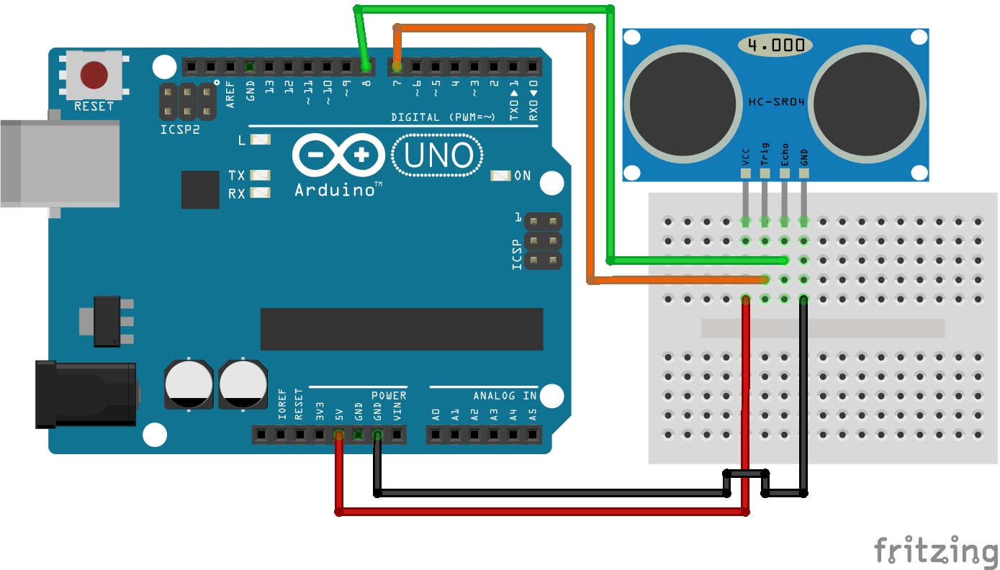

# Arduino HC-SR04 demo

The main purpose of this project is show how to use a HC-SR04 Ultrasonic Ranging Sensor in Arduino.

Required:

 - 1x Arduino UNO Rev3 (you can use other version)
 - 1x HC-SR04
 - 1x Breadboard
 - 4x Cables
 - 
 
In this project you will find:
 
 - [Source code](./hc_sr04_demo.ino). Arduino application source code with comments for know how and why it has been done
 - [Fritzing file](./hc_sr04.fzz). The project scheme.
 - [Scheme image](./hc_sr04_bb.png). Fritzing file exported to PNG file.

